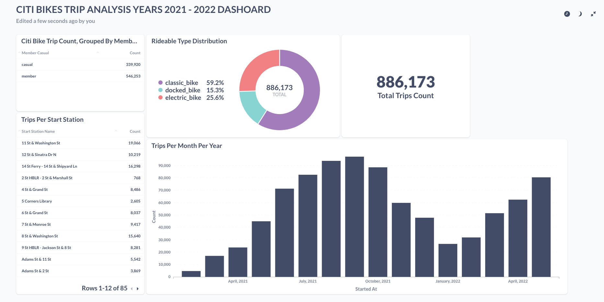

# Data Engineering Project

This folder contains my project for the [Data Engineering BootCamp](https://dphi.tech/learn/data-engineering/week-7-8-9/1377/data-engineering-project) By [DPhi](https://dphi.tech/bootcamps/data-engineering?itm_source=website&itm_medium=header&itm_campaign=maybootcamps)

## Problem

This is a simple project which takes data from [Citi Bike Trip Histories](https://ride.citibikenyc.com/system-data) and transforms it in order to visualize Rideable Type Distribution, Trips Per Start Station as well as Trips Per Month and Year.

## Dataset

The chosen dataset for this project is the [Citibike System Data](https://s3.amazonaws.com/tripdata/index.html).

## Dashboard

The dashboard is produced with the [Metabase Tool](https://www.metabase.com/) and still waiting deployment for the visual link to the project dashboard. You can follow the steps below to have the dashboard locally.

## Project details and implementation

Data ingestion is carried out by an Airflow DAG. The DAG downloads new data data monthly and ingests it in a local postgres database. The datasets are in compressed CSV format; the DAG downloads the CSV datasets and ingests them into postgres data tables.

The visualization is a simple Metabase report.


In the future the project is to make use of the cloud infrastructure Google Cloud Platform particulary Cloud Storage as the data lake and BigQuery as the data wharehouse mostly managed with Terraform.

## Reproduce the project

### Prerequisites

Make sure you have [Docker](https://docs.docker.com/get-docker/) installed in order to reproduce the project

### Clone the project

```
git clone https://github.com/PatrickCmd/data-engineering-zoomcamp-practice.git
```

### Start the airflow environment

Change directory to the `data-engineering-zoomcamp-practice/project/airflow` folder

```
cd data-engineering-zoomcamp-practice/project/airflow
```

Run the following command and write down the output

```
echo -e "AIRFLOW_UID=$(id -u)"
```

Create a copy of the `.env_example` file to `.env` and change the value of `AIRFLOW_UID` for the value of the previous command.


Build the custom Airflow Docker image:

```
docker-compose build
```

Initialize the Airflow Configs:

```
docker-compose up -d airflow-init
```

Run Airflow

```
docker-compose up -d
```

Go to the `data-engineering-zoomcamp-practice/project/`

Build and run the Postgres, PGAdmin and Metabase Docker images

```
docker-compose up -d --build
```

Access the PGAdmin GUI by browsing to `localhost:8089`. Email: admin@admin.com and password: root

Now register the postgres database in the GUI with database credentials as in your `.env` file.


You may now access the Airflow GUI by browsing to `localhost:8080`. Username and password are both airflow.

> IMPORTANT: this is NOT a production-ready setup! The username and password for Airflow have not been modified in any way; you can find them by searching for `_AIRFLOW_WWW_USER_USERNAME` and `_AIRFLOW_WWW_USER_PASSWORD` inside the docker-compose.yaml file.


Run the DAGS


Run the sample sql script in `data-engineering-zoomcamp-practice/project/sql_dw` folder and check in PGAdmin for the sample data


### The Metabase Dashboard Report

Access the metabase GUI by browsing to `localhost:3000`. Follow the instructions and register `pgdatabase` as your host and `citi_bikes` as your database.


Click the `Plus New` button to add questions and dashboard.

See my dashboard report below


